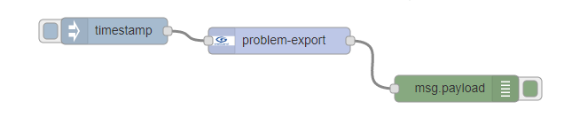

# node-red-contrib-theguard-servicedesk

## Connect your REALTECH theGuard! ServiceDesk to a Node-RED server 

[Node-RED][1] contribution package for REALTECH theGuard! ServiceDesk

## Install

Run the following command in the root directory of your Node-RED install

    npm install node-red-contrib-theguard-servicedesk

Run the following command for global install

    npm install -g node-red-contrib-theguard-servicedesk

try these options on npm install to build, if you have problems to install

    --unsafe-perm --build-from-source
    
## How to use

## Debug

Debug will be activated by starting Node-RED with debug mode:

    DEBUG=dot4-client node-red -v

[1]:https://nodered.org
